## React Native Paper Component Style Overrides

These styles override components will simplify this process so that you do not create the component designs to bring them in alignment with Brightlayer UI applications. 

- ### Avatar

    Recommended style overrides:
    * Text color of the Avatar for Primary Tonal Avatar: onPrimaryContainer
    * Background color of the Avatar for Primary Tonal Avatar: primaryContainer
    * Text color of the Avatar for Error Tonal Avatar: onErrorContainer
    * Background color of the Avatar for Error Tonal Avatar: errorContainer
    * Text color of the Avatar for Error Filled Avatar: onError
    * Background color of the Avatar for Error Filled Avatar: error

    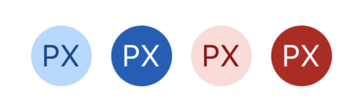<br/>

    Usage
    ```tsx
    import { Avatar } from 'react-native-paper';

    // Primary Tonal Avatar
    <Avatar.Text size={55} style={{backgroundColor:theme.colors.primaryContainer}} color={theme.colors.onPrimaryContainer} label="PX" />
    // Primary filled Avatar
    <Avatar.Text size={55} label="PX" />
    // Error Tonal Avatar
    <Avatar.Text size={55} style={{backgroundColor:theme.colors.errorContainer}} color={theme.colors.onErrorContainer} label="PX" />
    // Error filled Avatar
    <Avatar.Text size={55} style={{backgroundColor:theme.colors.error}} color={theme.colors.onError} label="PX" />
                        
    ```

- ###  Bottom Navigation

    Recommended style overrides:
    * Active color of the Selected Tab Text: primary
    * Background color of the Navigation Bar: surfaceContainer

    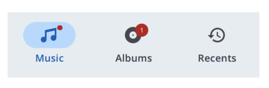<br/>

    Usage
    ```tsx
    import { BottomNavigation } from 'react-native-paper';

    <BottomNavigation
        activeColor={theme.colors.primary}
        barStyle ={{backgroundColor:theme.colors.surfaceContainer}}
        navigationState={{ index, routes }}
        onIndexChange={setIndex}
        renderScene={renderScene}
    />
    ```

- **Button**
  - #### Contained Mode
    Recommended style overrides:
    - Button color of the Error Contained Button: error
    - Text color of the Error Contained Button: onError


    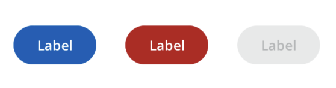<br/>

    Usage
    ```tsx
    import { Button } from 'react-native-paper';

    <Button mode="contained">
        Label
    </Button>
    <Button
        mode="contained"
       buttonColor={theme.colors.error}
        textColor={theme.colors.onError}
    >
        Label
    </Button>
    <Button mode="contained" disabled >
        Label
    </Button>
    ```

  - #### Outlined Mode

    Recommended style overrides:
    * Text color of the Error Outlined Button: error

    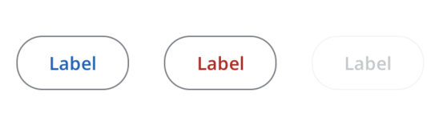<br/>

    Usage
    ```tsx
    import { Button } from 'react-native-paper';

    <Button mode="outlined">
        Label
    </Button>
    <Button
        mode="outlined"
        textColor={theme.colors.error}
    >
        Label
    </Button>
    <Button mode="outlined" disabled>
        Label
    </Button>
    ```

  - #### Text Mode

    Recommended style overrides:
    * Text color of the Error Text Button: error

    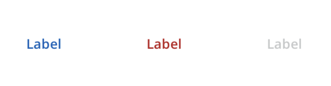<br/>

    Usage
    ```tsx
    import { Button } from 'react-native-paper';

    <Button mode="text">
        Label
    </Button>
    <Button
        mode="text"
        textColor={theme.colors.error}
    >
        Label
    </Button>
    <Button mode="text" disabled>
        Label
    </Button>
    ```
  - #### Elevated Mode

    Recommended style overrides:
    * Button color of the Elevated Button: surfaceContainerLow
    * Text color of the Error Elevated Button: error
    * Button color of the Error Elevated Button: surfaceContainerLow

    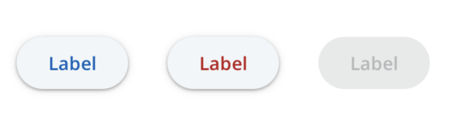<br/>

    Usage
    ```tsx
    import { Button } from 'react-native-paper';

    <Button
        mode="elevated"
        buttonColor={theme.colors.surfaceContainerLow}
    >
        Label
    </Button>
    <Button
        mode="elevated"
        textColor={theme.colors.error}
        buttonColor={theme.colors.surfaceContainerLow}
    >
        Label
    </Button>
    <Button
        mode="elevated"
        disabled
    >
        Label
    </Button>
    ```

  - #### Contained Tonal Mode

    Recommended style overrides:
    * Text color of the Error Text Button: onErrorContainer
    * Button color of the Error Text Button: errorContainer

    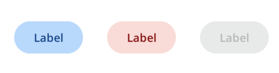<br/>

    Usage
    ```tsx
    import { Button } from 'react-native-paper';

    <Button mode="contained-tonal">
        Label
    </Button>
    <Button
        mode="contained-tonal"
        buttonColor={theme.colors.errorContainer}
        textColor={theme.colors.onErrorContainer}
    >
        Label
    </Button>
    <Button mode="contained-tonal" disabled>
        Label
    </Button>
    ```

- ###  Data Table

    Recommended style overrides:
    * Text color of Table Title: onSurface
    * Font size of Table Title: theme.fonts.labelLarge
    * Font size of Table Cell: theme.fonts.bodyMedium
    * Font for pagination Label needs to passed inside Text component: ```
    <Text style={{ ...theme.fonts.bodyMedium }}></Text>```
    * Font for pagination selectPageDropdownLabel needs to passed inside Text component: ```
    <Text style={{ ...theme.fonts.bodyMedium }}></Text>```
    

    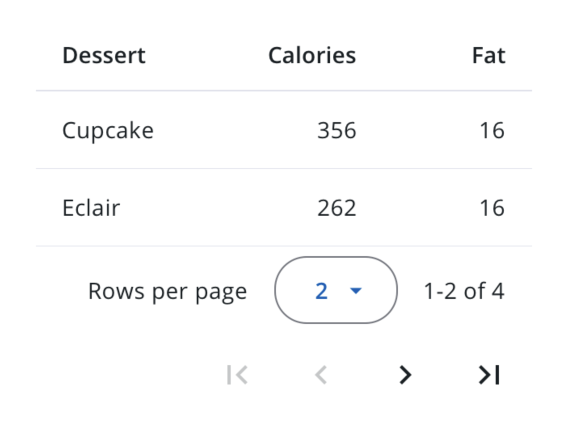<br/>

    Usage
    ```tsx
    import { DataTable } from 'react-native-paper';

    <DataTable>
        <DataTable.Header>
            <DataTable.Title
                textStyle={{ color: theme.colors.onSurface, ...theme.fonts.labelLarge }}
            >
                Dessert
            </DataTable.Title>
            <DataTable.Title
                numeric
                textStyle={{ color: theme.colors.onSurface, ...theme.fonts.labelLarge }}
            >
                Calories
            </DataTable.Title>
            <DataTable.Title
                numeric
                textStyle={{ color: theme.colors.onSurface, ...theme.fonts.labelLarge }}
            >
                Fat
            </DataTable.Title>
        </DataTable.Header>

        {items.slice(from, to).map((item) => (
            <DataTable.Row key={item.key}>
                <DataTable.Cell textStyle={{ ...theme.fonts.bodyMedium }} >{item.name}</DataTable.Cell>
                <DataTable.Cell textStyle={{ ...theme.fonts.bodyMedium }} >{item.calories}</DataTable.Cell>
                <DataTable.Cell textStyle={{ ...theme.fonts.bodyMedium }} numeric>{item.fat}</DataTable.Cell>
            </DataTable.Row>
        ))}

        <DataTable.Pagination
            page={page}
            numberOfPages={Math.ceil(items.length / itemsPerPage)}
            label={
                <Text style={{ ...theme.fonts.bodyMedium }}>
                    {`${from + 1}-${to} of ${items.length}`}
                </Text>
            }
            numberOfItemsPerPageList={numberOfItemsPerPageList}
            numberOfItemsPerPage={itemsPerPage}
            onItemsPerPageChange={onItemsPerPageChange}
            showFastPaginationControls
            selectPageDropdownLabel={
                <Text style={{ ...theme.fonts.bodyMedium }}>
                Rows per page
                </Text>
            }
        />
    </DataTable>
    ```

- ###  Icon button

    Recommended style overrides:
    * Background color for Contained mode: primary
    * Icon color for Contained mode: onPrimary
    * Background color for Contained-tonal mode: primaryContainer
    * Icon color for Contained-tonal mode: onPrimaryContainer

    <br/>

    Usage
    ```tsx
    import { IconButton } from 'react-native-paper';

    <IconButton icon="camera"/>
    <IconButton icon="video" mode='outlined'/>
    <IconButton icon="camera" mode='contained' containerColor={theme.colors.primary} iconColor={theme.colors.onPrimary} />
    <IconButton icon="video" mode='contained-tonal' containerColor={theme.colors.primaryContainer} iconColor={theme.colors.onPrimaryContainer}  />
    ```

- ###  Progress Bar

    Recommended style overrides:
    * Background color of the Track: surfaceContainerHighest

    <br/>

    Usage
    ```tsx
    import { ProgressBar } from 'react-native-paper';

    <ProgressBar
        progress={0.5}
        style={{ backgroundColor: theme.colors.surfaceContainerHighest }}
    />
    ```

- ###  Snackbar

    Recommended style overrides:
    * Background color of the SnackBar: inverseSurface


    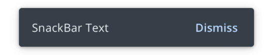<br/>

    ````tsx
    import { Snackbar } from 'react-native-paper';
    <Snackbar
        visible={true}
        action={{
            label: 'Dismiss',
            onPress: (): void => {},
        }}
        style={{ backgroundColor: theme.colors.inverseSurface }}
    >
        Snackbar Text
    </Snackbar>
    ````

- ###  Text Input

  - #### Flat Mode
    Recommended style overrides:
    - Underline color of Flat Text Input: onSurfaceVariant
    - Text color of Flat Text Input: onSurface
    - BackgroundColor of Flat Text Input: textFieldContainer
    - Underline color of Disabled Flat Text Input: onDisabledContainer
    - BackgroundColor of Disabled Flat Text Input: disabledContainer
    - Underline color of Error Flat Text Input: onSurfaceVariant
    - Text color of Error Flat Text Input: onSurface
    - BackgroundColor of Error Flat Text Input: textFieldContainer
    - Horizontal Margin for Helper Text: 8,
    - Horizontal Padding for Helper Text: 16,


    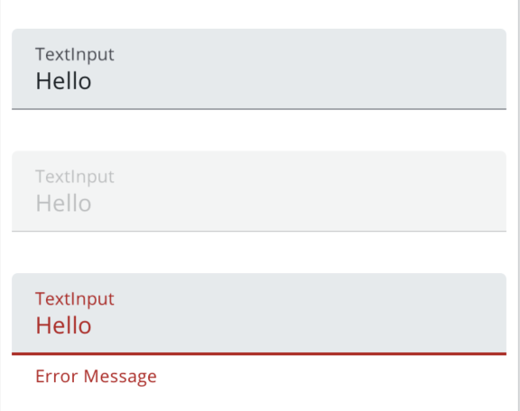<br/>

    Usage
    ```tsx
    import { TextInput } from 'react-native-paper';

    <TextInput
        label="TextInput"
        mode="flat"
        value={normalFilledText}
        textColor={theme.colors.onSurface}
        underlineColor={theme.colors.onSurfaceVariant}
        onChangeText={(value) => setNormalFilledText(value)}
        style={{backgroundColor: theme.colors.textFieldContainer}}
    />

    <TextInput
        label="TextInput"
        mode="flat"
        value='Hello'
        underlineColor={theme.colors.onDisabledContainer}
        disabled
        style={{backgroundColor: theme.colors.disabledContainer}}
    />

    <TextInput
        label="TextInput"
        mode="flat"
        textColor={hasError ? theme.colors.error : theme.colors.onSurface}
        value={errorFilledText}
        underlineColor={theme.colors.onSurfaceVariant}
        onChangeText={(value) => {
            setErrorFilledText(value);
            setHasError(value.length > 4);
        }}
        error={hasError}
        style={{backgroundColor: theme.colors.textFieldContainer}}
    />
    <HelperText 
        type="error" 
        visible={hasError} 
        style={{marginHorizontal: 8,paddingHorizontal: 16}}
    >
        Error Message
    </HelperText>
    ```

  - #### Outlined Mode

    Recommended style overrides:
    - BackgroundColor of Outlined Text Input: transparent
    - BackgroundColor of Disabled Outlined Text Input: transparent
    - BackgroundColor of Error Outlined Text Input: transparent
    - Horizontal Margin for Helper Text: 8,
    - Horizontal Padding for Helper Text: 16,

    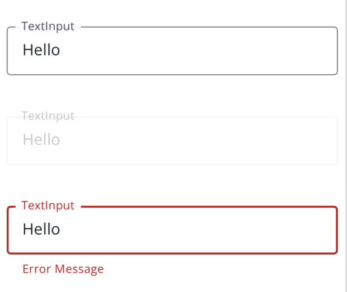<br/>

    Usage
    ```tsx
    import { TextInput } from 'react-native-paper';

    <TextInput
        label="TextInput"
        mode="outlined"
        value={normalFilledText}
        onChangeText={(value) => setNormalFilledText(value)}
        style={{
            margin: 8,
            backgroundColor: 'transparent',
        }}
    />

    <TextInput
        label="TextInput"
        mode="outlined"
        value={disabledFilledText}
        onChangeText={(value) => setDisabledFilledText(value)}
        disabled
        style={{
            margin: 8,
            backgroundColor: 'transparent',
        }}
    />

    <TextInput
        label="TextInput"
        mode="outlined"
        value={errorFilledText}
        onChangeText={(value) => {
            setErrorFilledText(value);
            setHasError(value.length > 4);
        }}
        error={hasError}
        style={{ marginHorizontal: 8, marginTop: 8, backgroundColor: 'transparent' }}
    />
    <HelperText type="error" visible={hasError} style={{
        marginHorizontal: 8,
        paddingHorizontal: 16,
    }}>
        Error Message
    </HelperText>

    ```

- ###  Toggle Button

    Recommended style overrides:
    * BorderWidth of ToggleButton: 1
    * Background color of the ToggleButton for selected: primaryContainer
    * Icon color of the ToggleButton for selected: onPrimaryContainer
    * Background color of the ToggleButton for non selected: 'transparent'
    * Icon color of the ToggleButton for non selected: onSurface


    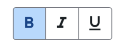<br/>

    ````tsx
    import { ToggleButton } from 'react-native-paper';

    //Button style for selected
    <ToggleButton
        icon="format-bold"
        value="bold"
        iconColor={ theme.colors.onPrimaryContainer }
        style={{
            backgroundColor: theme.colors.primaryContainer
            borderWidth: 1,
        }}
        rippleColor={'transparent'}
    />
    // style for not selected
    <ToggleButton
        icon="format-italic"
        value="italic"
        iconColor={theme.colors.onSurface}
        style={{
            backgroundColor:'transparent',
            borderWidth: 1,
        }}
        rippleColor={'transparent'}
    />
    ````